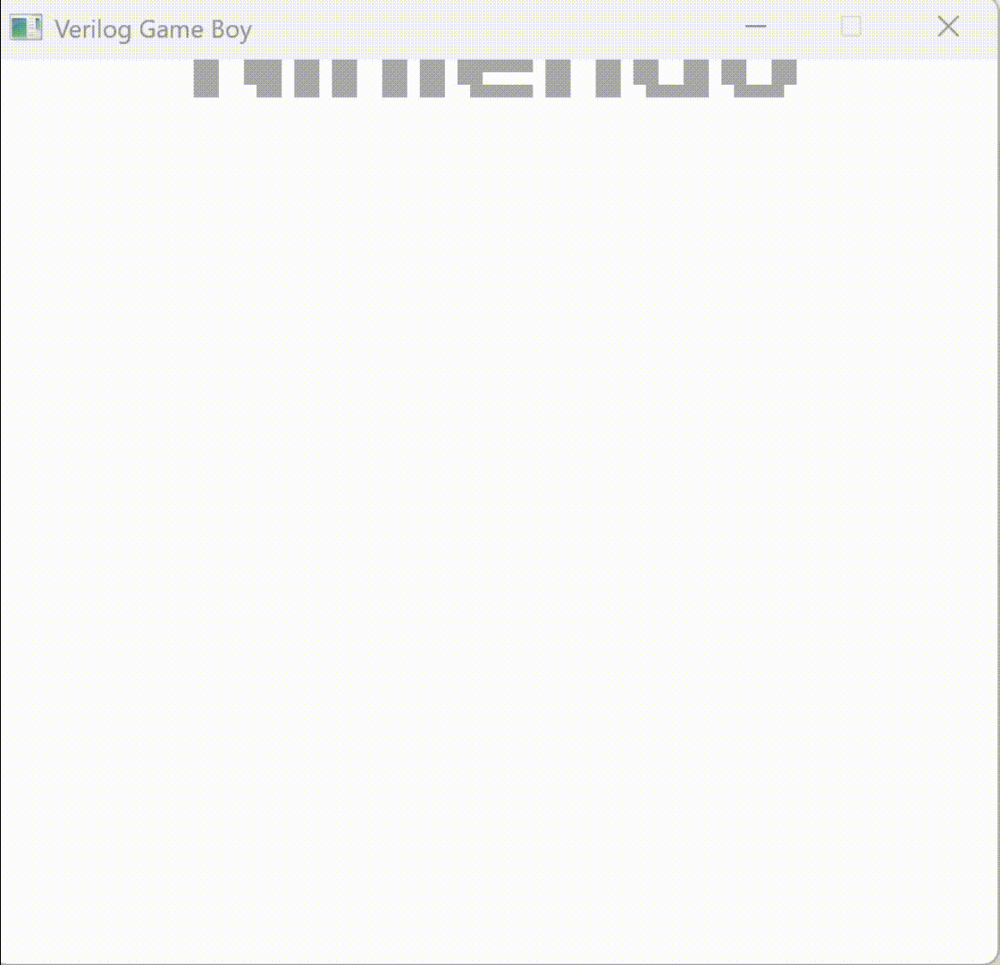

# CEMU

(name in the works)

There are three parts to this project
(1) C++ Gameboy emulator
(2) FPGA Gameboy emulator
(3) FPGA Gameboy emulator

The Gameboy emulators are working. The GBA emulator is WIP.

Here is the SystemVerilog Emulator simulated using Verilator.

Note: the gif is sped up 8 times.

So progress.
