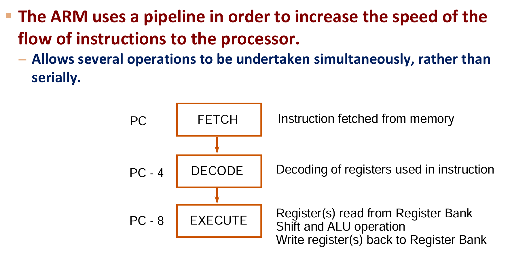
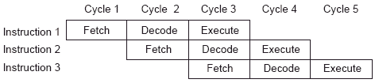
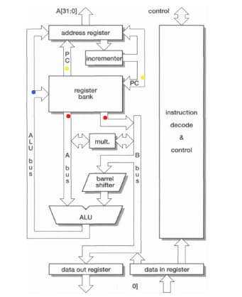

# ARM 7 TMDI

## Cycles Types

https://problemkaputt.de/gbatek-arm-cpu-instruction-cycle-times.htm

(1) N-Cycle: If the address jumps, it’s an N-cycle

(2) Streaming access = S-cycles

(3) If no data leaves the core, it’s an I-cycle

(4) Bus used, but RAM untouched -> C-cycle

### N - Non-sequential cycle

First access to a new address region. Address is not related to the previous bus access. (Called 1st Access in GBA language).
The execution time for 1N is 1 clock cycle (plus non-sequential access waitstates).

### S - Sequential cycle

Access to the next consecutive address. Happens after an N-cycle or another S-cycle.

Requests a transfer to/from an address which is located directly after the address used in the previous cycle. Ie. for 16bit or 32bit accesses at incrementing addresses, the first access is Non-sequential, the following accesses are sequential. (Called 2nd Access in GBA language).
The execution time for 1S is 1 clock cycle (plus sequential access waitstates).

### I - Internal Cycle

If no data leaves the core, it’s an I-cycle. ie: ALU operations, Shifts by register (LSL r1, r2), Multiply iterations, Pipeline refill bookkeeping.

CPU is just too busy, not even requesting a memory transfer for now.
The execution time for 1I is 1 clock cycle (without any waitstates).

### C - Coprocessor Cycle

Data transfer between ARM core and a coprocessor (e.g. CP15). Uses the data bus, but not memory.

The CPU uses the data bus to communicate with the coprocessor (if any), but no memory transfers are requested.

## ARM Opcode Binary Format

https://problemkaputt.de/gbatek-arm-instruction-summary.htm

```
  |..3 ..................2 ..................1 ..................0|
  |1_0_9_8_7_6_5_4_3_2_1_0_9_8_7_6_5_4_3_2_1_0_9_8_7_6_5_4_3_2_1_0|
  |_Cond__|0_0_0|___Op__|S|__Rn___|__Rd___|__Shift__|Typ|0|__Rm___| DataProc
  |_Cond__|0_0_0|___Op__|S|__Rn___|__Rd___|__Rs___|0|Typ|1|__Rm___| DataProc
  |_Cond__|0_0_1|___Op__|S|__Rn___|__Rd___|_Shift_|___Immediate___| DataProc
  |_Cond__|0_0_1_1_0_0_1_0_0_0_0_0_1_1_1_1_0_0_0_0|_____Hint______| ARM11:Hint
  |_Cond__|0_0_1_1_0|P|1|0|_Field_|__Rd___|_Shift_|___Immediate___| PSR Imm
  |_Cond__|0_0_0_1_0|P|L|0|_Field_|__Rd___|0_0_0_0|0_0_0_0|__Rm___| PSR Reg
  |_Cond__|0_0_0_1_0_0_1_0_1_1_1_1_1_1_1_1_1_1_1_1|0_0|L|1|__Rn___| BX,BLX
  |1_1_1_0|0_0_0_1_0_0_1_0|_____immediate_________|0_1_1_1|_immed_| ARM9:BKPT
  |_Cond__|0_0_0_1_0_1_1_0_1_1_1_1|__Rd___|1_1_1_1|0_0_0_1|__Rm___| ARM9:CLZ
  |_Cond__|0_0_0_1_0|Op_|0|__Rn___|__Rd___|0_0_0_0|0_1_0_1|__Rm___| ARM9:QALU
  |_Cond__|0_0_0_0_0_0|A|S|__Rd___|__Rn___|__Rs___|1_0_0_1|__Rm___| Multiply
  |_Cond__|0_0_0_0_0_1_0_0|_RdHi__|_RdLo__|__Rs___|1_0_0_1|__Rm___| ARM11:UMAAL
  |_Cond__|0_0_0_0_1|U|A|S|_RdHi__|_RdLo__|__Rs___|1_0_0_1|__Rm___| MulLong
  |_Cond__|0_0_0_1_0|Op_|0|Rd/RdHi|Rn/RdLo|__Rs___|1|y|x|0|__Rm___| MulHalfARM9
  |_Cond__|0_0_0_1_0|B|0_0|__Rn___|__Rd___|0_0_0_0|1_0_0_1|__Rm___| TransSwp12
  |_Cond__|0_0_0_1_1|_Op__|__Rn___|__Rd___|1_1_1_1|1_0_0_1|__Rm___| ARM11:LDREX
  |_Cond__|0_0_0|P|U|0|W|L|__Rn___|__Rd___|0_0_0_0|1|S|H|1|__Rm___| TransReg10
  |_Cond__|0_0_0|P|U|1|W|L|__Rn___|__Rd___|OffsetH|1|S|H|1|OffsetL| TransImm10
  |_Cond__|0_1_0|P|U|B|W|L|__Rn___|__Rd___|_________Offset________| TransImm9
  |_Cond__|0_1_1|P|U|B|W|L|__Rn___|__Rd___|__Shift__|Typ|0|__Rm___| TransReg9
  |_Cond__|0_1_1|________________xxx____________________|1|__xxx__| Undefined
  |_Cond__|0_1_1|Op_|x_x_x_x_x_x_x_x_x_x_x_x_x_x_x_x_x_x|1|x_x_x_x| ARM11:Media
  |1_1_1_1_0_1_0_1_0_1_1_1_1_1_1_1_1_1_1_1_0_0_0_0_0_0_0_1_1_1_1_1| ARM11:CLREX
  |_Cond__|1_0_0|P|U|S|W|L|__Rn___|__________Register_List________| BlockTrans
  |_Cond__|1_0_1|L|___________________Offset______________________| B,BL,BLX
  |_Cond__|1_1_0|P|U|N|W|L|__Rn___|__CRd__|__CP#__|____Offset_____| CoDataTrans
  |_Cond__|1_1_0_0_0_1_0|L|__Rn___|__Rd___|__CP#__|_CPopc_|__CRm__| CoRR ARM9
  |_Cond__|1_1_1_0|_CPopc_|__CRn__|__CRd__|__CP#__|_CP__|0|__CRm__| CoDataOp
  |_Cond__|1_1_1_0|CPopc|L|__CRn__|__Rd___|__CP#__|_CP__|1|__CRm__| CoRegTrans
  |_Cond__|1_1_1_1|_____________Ignored_by_Processor______________| SWI
```

## Pipeline

https://varshaaks.wordpress.com/2020/06/06/3-stage-pipeline/

https://www.geeksforgeeks.org/digital-logic/pipelining-in-arm/





### Stalls

The `-` means its stalled for that cycle.

```
Cycle         1       2       3       4
Normal:   F D E | F D E | F D E |
I-cycle:  F D E | - - E | F D E |
N-cycle:  F D E | - - E | - - E | F D E
Branch:   F D E | F D E | FLUSH | F - -
```

This is the STR pipeline.


### Jumps

```asm
JP B

target = old PC + B
```

#### Timeline

| Clock | Fetch  | Decode | Execute | Cycle type |
| ----- | ------ | ------ | ------- | ---------- |
| 0     | B      | —      | —       | S          |
| 1     | I1     | B      | —       | S          |
| 2     | I2     | I1     | **B**   | **N**      |
| 3     | target | —      | —       | S          |
| 4     | next   | target | —       | S          |

## Flow



## Conditions

Each one can be implemented as a enum.

Then we evaluate the condition combinationally using the IR as the input. We check it at the beginning of the CPU.

```

  Code Suffix Flags         Meaning
  0:   EQ     Z=1           equal (zero) (same)
  1:   NE     Z=0           not equal (nonzero) (not same)
  2:   CS/HS  C=1           unsigned higher or same (carry set)
  3:   CC/LO  C=0           unsigned lower (carry cleared)
  4:   MI     N=1           signed negative (minus)
  5:   PL     N=0           signed positive or zero (plus)
  6:   VS     V=1           signed overflow (V set)
  7:   VC     V=0           signed no overflow (V cleared)
  8:   HI     C=1 and Z=0   unsigned higher
  9:   LS     C=0 or Z=1    unsigned lower or same
  A:   GE     N=V           signed greater or equal
  B:   LT     N<>V          signed less than
  C:   GT     Z=0 and N=V   signed greater than
  D:   LE     Z=1 or N<>V   signed less or equal
  E:   AL     -             always (the "AL" suffix can be omitted)
  F:   NV     -             never (ARMv1,v2 only) (Reserved ARMv3 and up)
```

The decoder is responsible for decoding the various bits, and its latches stuff. The selected register will be fed into a multiplexer.

### Stalls

https://mgba-emu.github.io/gbatek/#logical-alu-operations

```
Logical ALU Operations
  Instruction                      Cycles   Flags  Expl.
  MOV{cond}{S} Rd,Op2              1S+x+y    NZc-  Rd = Op2
  MVN{cond}{S} Rd,Op2              1S+x+y    NZc-  Rd = NOT Op2
  ORR{cond}{S} Rd,Rn,Op2           1S+x+y    NZc-  Rd = Rn OR Op2
  EOR{cond}{S} Rd,Rn,Op2           1S+x+y    NZc-  Rd = Rn XOR Op2
  AND{cond}{S} Rd,Rn,Op2           1S+x+y    NZc-  Rd = Rn AND Op2
  BIC{cond}{S} Rd,Rn,Op2           1S+x+y    NZc-  Rd = Rn AND NOT Op2
  TST{cond}{P}    Rn,Op2           1S+x      NZc-  Void = Rn AND Op2
  TEQ{cond}{P}    Rn,Op2           1S+x      NZc-  Void = Rn XOR Op2
Add x=1I cycles if Op2 shifted-by-register. Add y=1S+1N cycles if Rd=R15.
Carry flag affected only if Op2 contains a non-zero shift amount.
```

`-` means stalled

x=1I

Execute sets a `stall` latch to `false` at the end of the last cycle in the execution of an instruction. If it needs an extra cycle then it sets `stall` to true. `F` & `D` only activate if `stall` is `false`.

| Cycle | 1   | 2   | 3   | 4   | 5   | 5   | 6   |
| ----- | --- | --- | --- | --- | --- | --- | --- |
| I1    | F   | D   | E   | I   |     |     |     |
| I2    |     | F   | D   | -   | E   |     |     |
| I3    |     |     | F   | -   | D   | E   |     |
| I4    |     |     |     |     | F   | D   | E   |

Now if I1 has x=1I and I2 also has x=I2 then:

| Cycle | 1   | 2   | 3   | 4   | 5   | 5   | 6   | 7   | 8   |
| ----- | --- | --- | --- | --- | --- | --- | --- | --- | --- |
| I1    | F   | D   | E   | I   |     |     |     |     |     |
| I2    |     | F   | D   | -   | E   | I   |     |     |     |
| I3    |     |     | F   | -   | D   | -   | E   |     |     |
| I4    |     |     |     |     | F   | -   | D   | E   |     |
| I5    |     |     |     |     |     |     | F   | D   | E   |

y=1S+1N

Changing the PC causes a pipeline reset.

A reset means that we flush the whole pipeline and start anew

| Cycle   | 1   | 2   | 3   | 4   | 5   | 5   | 6   | 7   | 8   |
| ------- | --- | --- | --- | --- | --- | --- | --- | --- | --- |
| I1      | F   | D   | E   |     |     |     |     |     |     |
| Discard |     | F   | D   |     |     |     |     |     |     |
| Discard |     |     | F   |     |     |     |     |     |     |
| I2      |     |     |     | F   | D   | E   |     |     |     |
| I3      |     |     |     |     | F   | D   | E   |     |     |
| I4      |     |     |     |     |     | F   | D   | E   |     |

Alternatively the we could stall the Fetcher from the Decoder, which would eliminate the second row of Discard.

### Micro Ops

Each Micro op can be performed in parallel during a cycle:

- Compute the address
  - Incrementer
  - ALU result
  - Directly from a Register

- Memory access
  - read_en
  - write_en

- ALU Op
  - Input `Rn` and `Rm` directly from registers
  - `Rm` is routed through the barrel shifter first.

- Change up the flags

- Registers
  - Read three registers
  - Write to two registers
